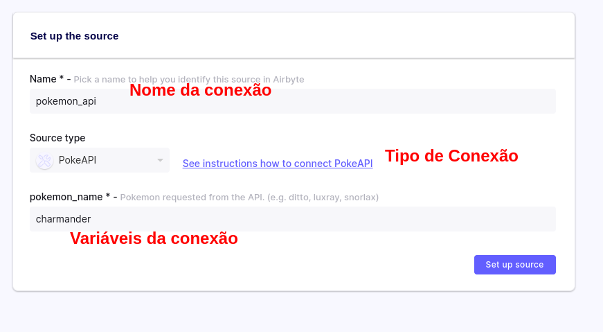

# Airbyte Tooltorial

Neste tooltorial vamos aprender como utilizar a ferramenta de integração Airbyte nos padrões da Indicium.


## Configurando o projeto

### Requisitos

Para realizar esse projeto você vai precisar:

- Instância do Airbyte rodando localmente
- Banco Postgres rodando localmente
- Dbeaver

### Instalando o Airbyte

Para facilitar a criação do ambiente, um arquivo `docker-compose` está disponível na pasta do projeto.

Se você não tem o docker instalado na sua máquina siga essas [instruções](https://www.docker.com/products/docker-desktop).

```
docker-compose up
```

### (Opcional) Criando um Banco Postgres Local

Se você não possui um banco Postgres rodando localmente para utilizar nesse projeto, rode o comando abaixo em um novo terminal:

```
    docker rm --force data-warehouse
    docker run --rm --name data-warehouse -e POSTGRES_PASSWORD=password -p 5432:5432 -d postgres
```

### Acessando o Airbyte

Se tudo deu certo no passo anterior, o Airbyte deverá estar rodando em [http://localhost:8000](http://localhost:8000).

## Criando uma source e destination local

No primeiro exemplo vamos realizar uma source e destino no mesmo banco de dados local Postgres. Antes precisamos subir alguns dados no nosso banco de dados:

```
createdb -h localhost -U postgres -p 5432 northwind
cat data/northwind.sql | psql -h localhost -U postgres -p 5432 -d northwind

```
### Configurar source Postgres

Os dados da Northwnd serão nossos dados "fonte".

[Exemplo de como configurar source]


### Configurar Destination CSV

Agora vamos exportar esses dados como um destino CSV. Por padrão, os arquivos ficarão em uma pasta temporária no caminho `/tmp/airbyte_local`. 

## Extraindo de uma fonte remota 

Agora vamos extrair os dados de um banco de dados remoto. Vamos usar o banco de dados da AdventureWorks. Para acessá-lo vamos utilizar as seguintes infos:

```
Host: 35.239.223.162
Port: 5432
User: stitch_extract
Password: etl_101_passwd
Database: Adventureworks
```

Nosso destino vai ser o nosso Data Warehouse local! Para isso primeiro precisamos criar um banco de dados de destino para escrever nossos dados. Vamos chamar desse banco de dados de "data warehouse" e nosso schema de destino de "analytics".

```
createdb psql -h localhost -U postgres -p 5432 data-warehouse
```

## Extraindo de uma API

Agora vamos mostrar um exemplo de uma consulta de uma API pública utilizada para treinamento. É um caso similar ao que está disponível no [python_tap_tooltorial](). Para criar um conector de API personalizado siga as instruções neste [link](https://docs.airbyte.com/connector-development/cdk-python).



Como destino vamos adicionar um arquivo JSON local. Assim como no destino CSV vamos escrever no `/tmp/airbyte_local`.


# Referências

Esse tooltorial foi baseado em alguns exemplos disponíveis na web:

[Deploy Airbyte](https://docs.airbyte.com/quickstart/deploy-airbyte)
[Airbyte Quickstart](https://docs.airbyte.com/quickstart/add-a-source)